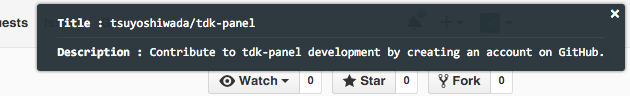

tdk-panel
=========

It's a Bookmarklet. Outputs of the page title, description, and the keyword.




## Usage

Create a new bookmark.  
Type a `javascript:` in the URL column. And then paste the contents of the [min.js](https://github.com/tsuyoshiwada/tdk-panel/blob/master/min.js).

To display the panel, run the bookmarklet that you have created.


## Develop

```bash
$ git clone https://github.com/tsuyoshiwada/tdk-panel.git
$ cd tdk-panel
$ npm i
```

build a script.

```bash
$ npm run build
```
